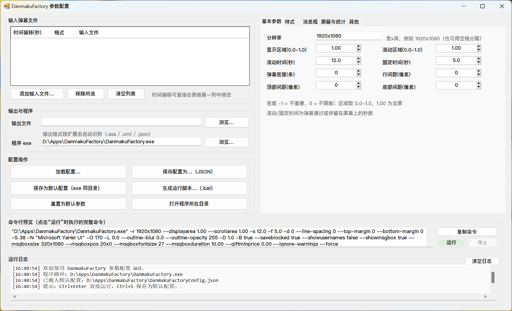
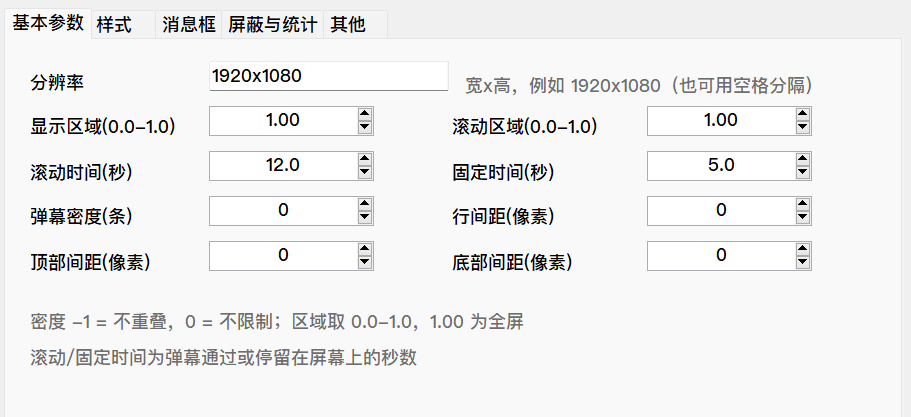
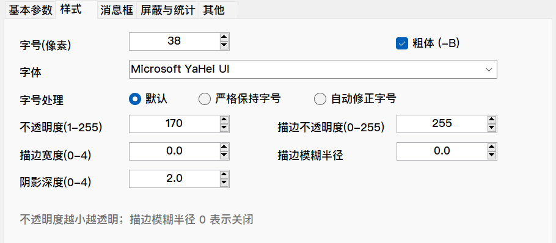
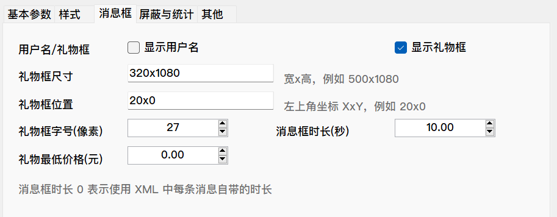
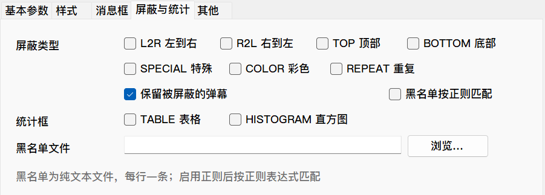
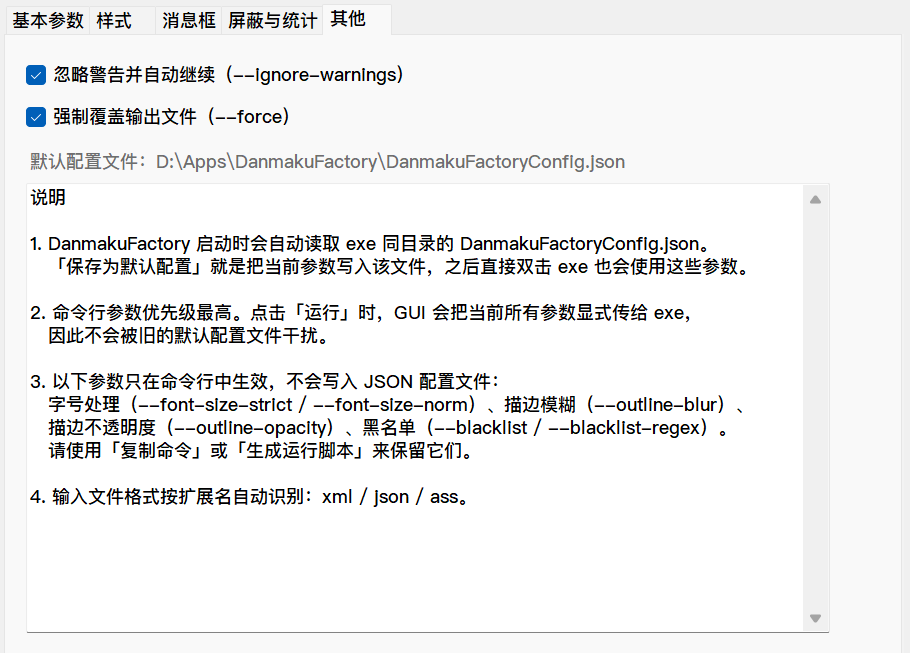

# DanmakuFactory 参数配置 GUI

[](LICENSE)
[](#系统要求)
[](#系统要求)
[](https://github.com/Steel-Yao/DanmakuFactoryConfigGUI/actions/workflows/validate.yml)
[](https://github.com/Steel-Yao/DanmakuFactoryConfigGUI/releases)

一个面向 DanmakuFactory CLI 的 Windows 参数配置图形界面。使用单个 PowerShell 脚本和 .NET WinForms 实现，不需要 Python、Node.js 或额外安装 .NET SDK，双击 `DanmakuFactoryGUI.cmd` 即可使用。

> 本项目是第三方社区 GUI，不是 [hihkm/DanmakuFactory](https://github.com/hihkm/DanmakuFactory) 的官方项目。弹幕转换核心、CLI 参数定义和输出格式均来自上游 DanmakuFactory。



## 功能

- **输入管理**：一次添加多个 `.xml`、`.json`、`.ass` 文件，并为每个文件单独设置时间偏移。
- **常用参数配置**：分辨率和区域、滚动/固定时长、字体和字号、透明度、描边、阴影、礼物框等。
- **屏蔽与统计**：按弹幕类型、颜色、重复内容屏蔽，支持黑名单文件和 TABLE/HISTOGRAM 统计模式。
- **实时命令预览**：底部始终显示最终执行的完整命令行，可一键复制到终端。
- **配置读写**：加载/导出 JSON 配置，并把当前参数保存为 exe 同目录的 `DanmakuFactoryConfig.json`。
- **直接运行**：在 GUI 内启动 DanmakuFactory，实时查看输出日志，也可以停止正在运行的转换。
- **脚本生成**：生成双击即可运行的 `.bat`，适合重复处理同一批弹幕。
- **Windows 适配**：自动定位 exe、高 DPI 缩放、无额外运行依赖。

## 快速开始

### 1. 获取 DanmakuFactory

从 [DanmakuFactory Releases](https://github.com/hihkm/DanmakuFactory/releases) 下载 Windows CLI 版本并解压。建议使用 v1.70.x；本项目不会重新分发 `DanmakuFactory.exe`。

### 2. 获取本 GUI

```powershell
git clone https://github.com/Steel-Yao/DanmakuFactoryConfigGUI.git
```

也可以直接在 GitHub 页面点击 **Code → Download ZIP**。

### 3. 放置文件

脚本会自动在当前目录和上一级目录中查找 `DanmakuFactory.exe`。下面两种结构都可以：

```text
DanmakuFactory\
├─ DanmakuFactory.exe
└─ DanmakuFactoryConfigGUI\
   ├─ DanmakuFactoryGUI.cmd
   └─ DanmakuFactoryGUI.ps1
```

```text
DanmakuFactory\
├─ DanmakuFactory.exe
├─ DanmakuFactoryGUI.cmd
└─ DanmakuFactoryGUI.ps1
```

### 4. 开始转换

1. 双击 `DanmakuFactoryGUI.cmd`。
2. 点击「添加输入文件…」选择弹幕文件。
3. 设置输出扩展名：`.ass`、`.xml` 或 `.json`。
4. 按需修改参数，底部检查完整命令行。
5. 点击「运行」，或先「复制命令」「生成运行脚本…」再执行。

## 界面预览

### 基本参数



### 样式参数



### 消息框



### 屏蔽与统计



### 其他



## 参数覆盖范围

GUI 覆盖 DanmakuFactory v1.70 CLI 的常用参数：

| 分组 | 主要参数 |
| --- | --- |
| 输入输出 | `-i`、`-o`、逐文件 `-t` |
| 画面 | `-r`、`--displayarea`、`--scrollarea` |
| 时间 | `-s`、`-f` |
| 密度与边距 | `-d`、`--line-spacing`、`--top-margin`、`--bottom-margin` |
| 字体样式 | `-S`、`-N`、`-O`、`-L`、`-D`、`-B` |
| 字号处理 | `--font-size-strict`、`--font-size-norm` |
| 消息框 | `--saveblocked`、`--showusernames`、`--showmsgbox`、`--msgboxsize`、`--msgboxpos`、`--msgboxfontsize`、`--msgboxduration`、`--giftminprice` |
| 屏蔽与统计 | `-b`、`--statmode`、`--blacklist`、`--blacklist-regex` |
| 运行控制 | `--ignore-warnings`、`--force` |

当前 GUI 不提供任意参数输入框，也不处理 DanmakuFactory 的 `-c`、`--save`、`-h` 等管理选项。需要额外参数时，可以使用「复制命令」后在终端中手动追加。

## 配置文件行为

DanmakuFactory 启动时会自动读取 exe 同目录的 `DanmakuFactoryConfig.json`。

点击「保存为默认配置」会把当前参数写入该文件，之后直接运行 exe 也会使用这些参数。点击「保存配置为…」则可以导出到任意位置，便于备份或在不同电脑之间复用。

在下一次运行时，GUI 会把当前所有参数显式传给 DanmakuFactory。命令行参数优先级高于配置文件，因此旧的默认配置不会干扰 GUI 当前显示的参数。

以下参数只在命令行或运行脚本中生效，不会被写入 JSON 配置文件：

- 字号处理：`--font-size-strict`、`--font-size-norm`
- 描边模糊：`--outline-blur`
- 描边不透明度：`--outline-opacity`
- 黑名单：`--blacklist`、`--blacklist-regex`

## 从源码运行

需要 Windows PowerShell 5.1 或 PowerShell 7：

```powershell
powershell.exe -NoProfile -STA -ExecutionPolicy Bypass -File .\DanmakuFactoryGUI.ps1
```

开发自检可以生成截图并输出当前命令：

```powershell
$shot = Join-Path $env:TEMP 'DanmakuFactoryConfigGUI-selftest.png'
powershell.exe -NoProfile -STA -ExecutionPolicy Bypass `
    -File .\DanmakuFactoryGUI.ps1 -SelfTestShot $shot
```

## 系统要求

- Windows 10 或 Windows 11
- Windows PowerShell 5.1 或更新版本（Windows 10/11 自带）
- DanmakuFactory CLI 可执行文件（未包含在本仓库中）

推荐使用上游 v1.70.x。不同版本的 DanmakuFactory 如果新增参数，GUI 仍可运行，但新增参数不会自动出现在界面中。

## 常见问题

### 双击 `.cmd` 后没有界面

启动脚本会隐藏控制台窗口；如果启动失败，脚本目录下会生成 `DanmakuFactoryGUI-error.log`。先查看该文件，再检查 PowerShell 执行策略和杀毒软件拦截记录。

### 提示找不到 `DanmakuFactory.exe`

把 exe 放在 GUI 脚本同一目录或上一级目录，或者点击界面中的「浏览…」手动指定。也可以在启动后检查「程序 exe」输入框。

### 保存默认配置后没有生效

确认保存路径是当前使用的 `DanmakuFactory.exe` 所在目录。GUI 的「其他」选项卡会显示实际的 `DanmakuFactoryConfig.json` 路径。

### 输出文件被跳过或覆盖提示

默认勾选「忽略警告」和「强制覆盖」。如果取消勾选，DanmakuFactory 可能等待确认输入；GUI 会在启动前给出提示。

### 字体列表或界面显示不完整

脚本按系统 DPI 创建控件。屏幕较小时，窗口会自动最大化；如果仍然拥挤，请提高分辨率或降低 Windows 缩放比例。

## 快捷键

- `Ctrl+Enter`：运行
- `Ctrl+S`：保存为默认配置

## 贡献

欢迎提交 Issue 和 Pull Request。提交前请阅读 [CONTRIBUTING.md](CONTRIBUTING.md)，重点确认 Windows PowerShell 5.1 兼容性和高 DPI 布局没有回归。

## 许可与致谢

本项目使用 [MIT License](LICENSE)。

DanmakuFactory 由 [hkm](https://github.com/hihkm) 开发，原始项目同样使用 MIT License。本仓库只包含 GUI 包装脚本和界面截图，不分发 DanmakuFactory 二进制文件或上游源代码。
